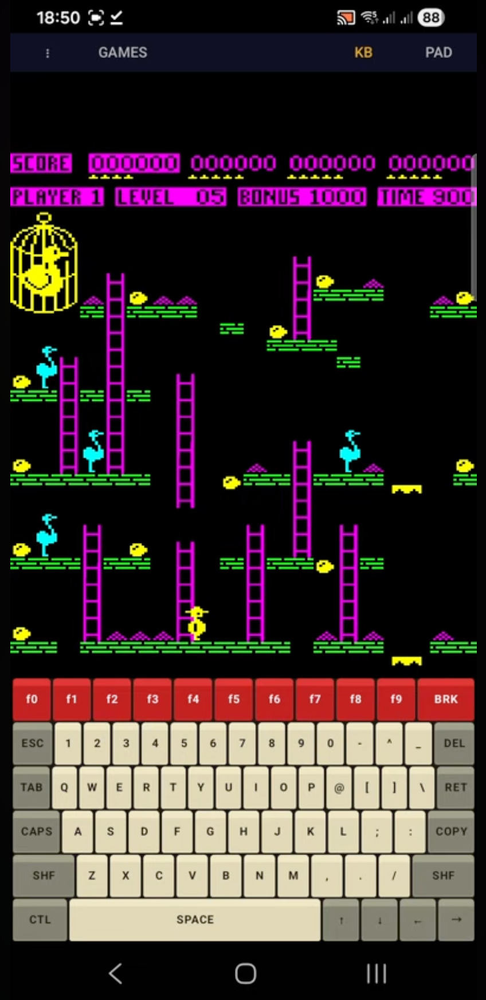
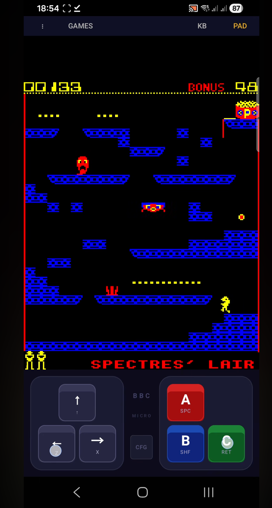
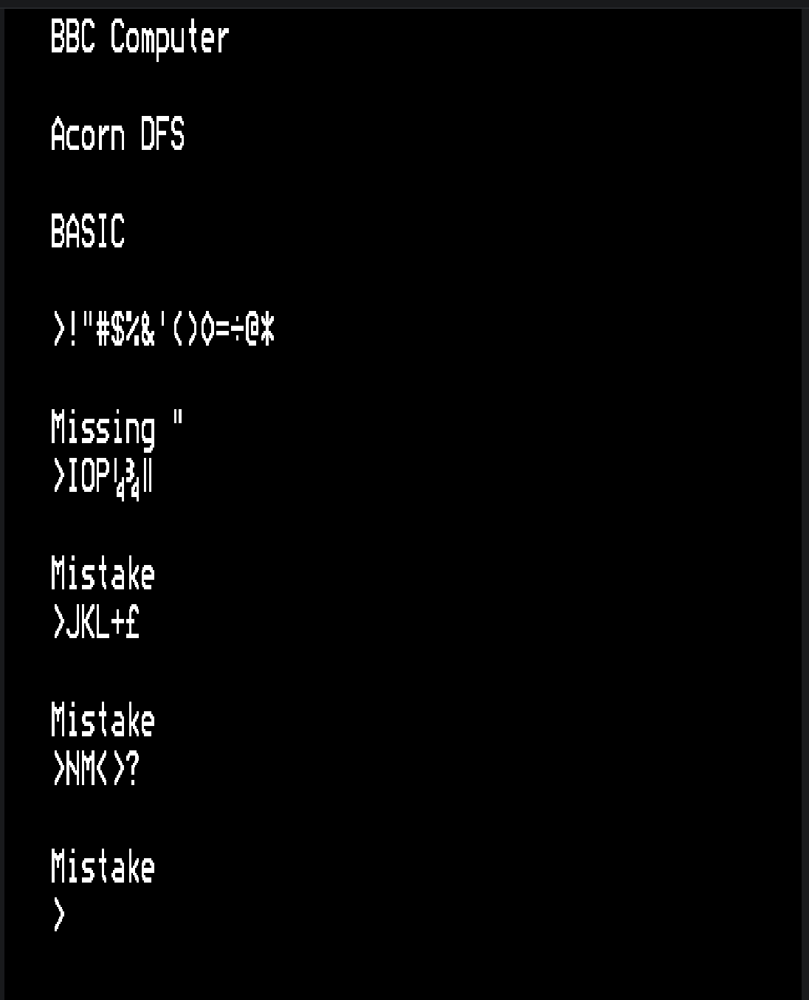

# BeebDroid

An Android port of [BeebEm](https://github.com/stardot/beebem-windows), the
BBC Micro Model B emulator. The original BeebEm core runs as native C++ via
JNI; the UI is Jetpack Compose.



## Features

- **BBC Micro Model B** emulation (the BeebEm core ported with minimal changes)
- **On-screen BBC keyboard** with the original BBC layout, plus a
  configurable **on-screen joypad** with per-disc key mappings (zoom in to
  pick keys on small screens)
- **Game picker** — browses curated BBC games hosted at
  [stairwaytohell.com](http://www.stairwaytohell.com/)
- **Archive search** — searches the
  [bbcmicro.co.uk](https://www.bbcmicro.co.uk) catalogue and downloads disc
  images directly into the emulator
- **Save / load disc images** to and from device storage via the system file
  picker
- **Snapshot states** — quick save/load of the emulator's full state
- Hardware keyboard support when an external keyboard is connected

## Screenshots

| | |
|--|--|
|  |  |
|  | |

## Building

Requirements:

- **Android Studio** (JBR is fine for the JDK)
- **Android SDK** with NDK and CMake (the Gradle build will prompt to install
  the right NDK / CMake versions on first build)
- **Android API 28** minimum, builds against API 36
- ABIs built: `arm64-v8a`, `x86_64`

Standard Gradle build:

```sh
./gradlew assembleDebug
```

The debug APK lands in `app/build/outputs/apk/debug/`.

To install on a connected device:

```sh
./gradlew installDebug
```

## Using the emulator

When the app starts, the BBC boots into its OS prompt and shows
`BBC Computer 32K` as it would on real hardware.

**Toolbar buttons** (top of screen):

- `⋮` — overflow menu: load/save/eject discs, save/load snapshots, send
  `SHIFT+BREAK` (used to boot the disc currently in drive 0)
- `GAMES` — open the curated game picker
- `SEARCH` — search the bbcmicro.co.uk archive
- `KB` — toggle the on-screen BBC keyboard
- `PAD` — toggle the on-screen joypad

**Booting a disc:**

1. Tap `GAMES` or `SEARCH`, pick a title, wait for the download to complete
2. The disc auto-mounts into drive 0 and a `SHIFT+BREAK` is sent automatically

For your own discs (`.ssd`, `.dsd`, `.adfs`, `.img`), use `⋮ → Load Disc` and
then `⋮ → SHF+BRK` to boot them.

**Joypad:**

Tap `PAD` to bring up the on-screen joypad. Tap `CFG` and then any joypad
button to remap it to a BBC key. Mappings are remembered per-disc — load a
disc first, then configure the joypad, and the mapping will be restored next
time you mount that disc.

## Project layout

```
app/src/main/
├── assets/BeebData/         BBC system ROMs and BeebEm config files
├── cpp/
│   ├── core/                Unmodified BeebEm core (GPL v2+)
│   ├── platform/            Android platform shim (audio, video buffer, etc.)
│   └── jni/                 JNI bridge between Kotlin and the C++ core
├── java/.../android/        Kotlin UI (Compose) + GLSurfaceView renderer
└── res/                     Android resources
```

The interesting Android-specific code is `BeebGLSurfaceView.kt` (the GL
texture upload path) and `cpp/jni/beebem_jni.cpp` (the JNI bridge with
wall-clock pacing and pending-op queues for thread-safe BBC state mutation).

## License

BeebDroid inherits the BeebEm license: **GPL v2 or later**. See the
copyright headers on the files in `app/src/main/cpp/core/`. The BBC Micro
system ROMs in `app/src/main/assets/BeebData/BeebFile/BBC/` are © Acorn /
ARM and are bundled here following the same convention as upstream BeebEm.

The Android shim (`app/src/main/cpp/platform/`, `cpp/jni/`,
`java/uk/org/beebem/android/`) is also released under GPL v2+.

## Credits

- **David Alan Gilbert**, **Mike Wyatt**, **Richard Gellman** and
  contributors — the BeebEm emulator
- **Peter Johnson** — for the original macOS port of BeebEm
  ([beebem-macos](https://github.com/0x1337c0d3/beebem-macos)), which
  this Android port is built on top of, and for all his patient guidance
- **stairwaytohell.com** and **bbcmicro.co.uk** for the BBC software
  archives
- BBC Micro Model B © Acorn Computers / ARM
